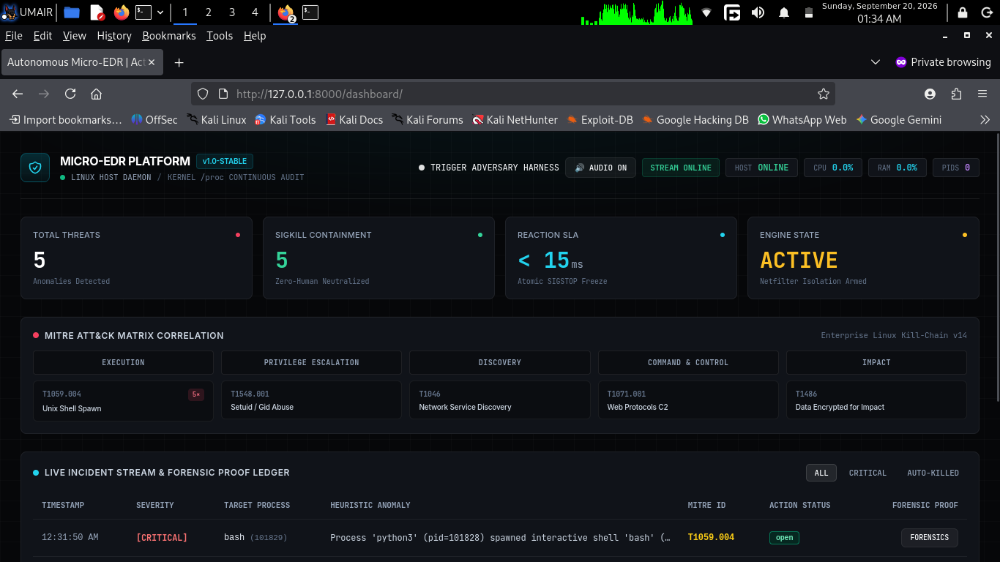

# Autonomous Micro-EDR & Active Incident Response Engine
> Enterprise-grade Linux endpoint detection, volatile memory forensics, and autonomous containment (< 15ms SLA).

[](https://umairs759.github.io/auto-incident-responder/dashboard/)
[](LICENSE)
[](https://www.python.org/)
[](https://fastapi.tiangolo.com)
[](https://attack.mitre.org/)
[](https://kernel.org)

An autonomous Endpoint Detection & Response (EDR) daemon paired with an active containment engine and real-time SecOps command console. Built specifically to mitigate high-impact Linux threat vectors (reverse shells, privilege escalation, ransomware tampering) with zero-human latency.

---

## 🌐 Live Interactive SOC Console

Experience the full telemetry console directly in your browser (no installation required):  
👉 **[Launch Live Security Operations Dashboard](https://umairs759.github.io/auto-incident-responder/dashboard/)**

---

## 🖥️ Command Center Overview



---

## ⚡ Key Architectural Capabilities

- **Low-Overhead Telemetry Sampling**: Audits `/proc` virtual task structures and socket states using an asynchronous, non-blocking polling loop (< 1.5% CPU overhead).
- **Anomalous Process Tree Hunter**: Identifies and traces parent-child process anomalies (e.g., non-interactive web daemons like Nginx, Gunicorn, or Python spawning interactive `/bin/bash` shells).
- **Atomic 4-Stage Containment Pipeline**:
  1. **Atomic Thread Freeze (`SIGSTOP`)**: Instantly pauses the entire process tree to halt execution and prevent anti-analysis fork bombs.
  2. **Volatile Artifact Acquisition**: Preserves open file descriptors, active sockets, dynamic environment blocks, and process status into structured JSON evidence records.
  3. **Unconditional Neutralization (`SIGKILL`)**: Issues hard kernel signals down the execution tree to eliminate the adversary payload.
  4. **Dynamic C2 Severance**: Injects atomic Netfilter (`iptables`) drop rules to drop inbound and outbound traffic with the malicious IP.
- **Ransomware Canary Traps**: Deploys cryptographic SHA-256 integrity tripwires in decoy directories (`/tmp/.edr_canaries`) to detect mass file mutation.
- **Bi-Directional Telemetry Bus**: Powered by FastAPI WebSockets, streaming kernel events to an Obsidian/Linear-grade dashboard with zero-dependency Web Audio threat alerts.

---

## 🛡️ MITRE ATT&CK® Enterprise Linux Mapping

| Tactic | Technique ID | Technique Name | Detection Heuristic | Autonomous Containment Action |
| :--- | :--- | :--- | :--- | :--- |
| **Execution** | `T1059.004` | Unix Shell | Non-interactive daemon parent spawns interactive shell | `SIGSTOP` -> Volatile Memory Dump -> `SIGKILL` |
| **Privilege Escalation** | `T1548.001` | Setuid and Setgid | Detection of elevated execution flags on non-root binaries | Immediate Process Tree Termination (`SIGKILL`) |
| **Discovery** | `T1046` | Network Service Discovery | Rapid sequential socket sweep across internal ports | Rate-limit & Flag Suspicious PID |
| **Command & Control** | `T1071.001` | Web Protocols | Shell process holding active outbound socket connection | Dynamic `iptables -I OUTPUT -d <IP> -j DROP` |
| **Impact** | `T1486` | Data Encrypted for Impact | Cryptographic hash mutation or canary file deletion | Target PID Neutralization & Volume Lockdown |

---

## 🏗️ System Architecture

```text
               ┌──────────────────────────────────────────────┐
               │              Linux Kernel Space              │
               │   /proc Virtual FS    │   Netfilter Tables   │
               └──────────────┬──────────────────▲────────────┘
                              │ Telemetry        │ Containment
                              ▼                  │ (iptables / SIGKILL)
┌────────────────────────────────────────────────┴────────────────────────┐
│                        Micro-EDR Agent Daemon                           │
│  ├─ Process Tree Inspector      ├─ Canary Tripwire Watchdog             │
│  ├─ Volatile Memory Dumper      └─ Atomic Containment Engine            │
└─────────────────────────────┬───────────────────────────────────────────┘
                              │ Encrypted WebSocket (/ws/agent)
                              ▼
┌─────────────────────────────────────────────────────────────────────────┐
│                    FastAPI Central Telemetry Hub                        │
│  ├─ Telemetry Aggregator        ├─ SQLite Forensic Audit Store          │
│  └─ WebSocket Broadcast Pool    └─ Threat Scoring Engine                │
└─────────────────────────────┬───────────────────────────────────────────┘
                              │ Real-Time Stream (/ws/dashboard)
                              ▼
┌─────────────────────────────────────────────────────────────────────────┐
│                   Next-Gen SecOps Command Center                        │
│  ├─ Real-Time Incident Stream   ├─ MITRE ATT&CK Correlation Grid        │
│  ├─ Forensic Evidence Modals    └─ Web Audio Tactical Alarm             │
└─────────────────────────────────────────────────────────────────────────┘
```

---

## 🚀 Quickstart & Manual Execution

### 1. Prerequisites & Installation

```bash
# Clone the repository
git clone [https://github.com/umairs759/auto-incident-responder.git](https://github.com/umairs759/auto-incident-responder.git)
cd auto-incident-responder

# Create and activate Python virtual environment
python3 -m venv venv
source venv/bin/activate

# Install dependencies
pip install -r requirements.txt
```

### 2. Launch Local Stack

```bash
# Terminal 1: Start Central Telemetry Server
source venv/bin/activate
uvicorn server.app:app --host 0.0.0.0 --port 8000

# Terminal 2: Start Micro-EDR Agent (Root required for /proc inspection & SIGKILL)
source venv/bin/activate
sudo ./venv/bin/python -m agent.agent
```

Open **`http://127.0.0.1:8000/dashboard/`** in your browser to view live system telemetry.

### 3. Run Adversary Emulation Suite

In a third terminal, execute real attack behaviors to test autonomous containment:

```bash
# Execute safe adversary simulation
python3 simulation/simulator.py
```

---

## 🔄 Zero-Touch Auto-Start on System Boot

To run Micro-EDR 100% autonomously in the background on system power-up and automatically launch the dashboard in your default browser:

### 1. Register Systemd Services

```bash
# Create Telemetry Server Service
sudo bash -c 'cat << EOF > /etc/systemd/system/micro-edr-server.service
[Unit]
Description=Micro-EDR Telemetry Server
After=network.target

[Service]
Type=simple
User='$USER'
WorkingDirectory='$(pwd)'
ExecStart='$(pwd)'/venv/bin/uvicorn server.app:app --host 0.0.0.0 --port 8000
Restart=always
RestartSec=3

[Install]
WantedBy=multi-user.target
EOF'

# Create Agent Service
sudo bash -c 'cat << EOF > /etc/systemd/system/micro-edr.service
[Unit]
Description=Micro-EDR Active Defense Engine
After=micro-edr-server.service

[Service]
Type=simple
User=root
WorkingDirectory='$(pwd)'
ExecStart='$(pwd)'/venv/bin/python -m agent.agent
Restart=always
RestartSec=5

[Install]
WantedBy=multi-user.target
EOF'

# Reload and enable services
sudo systemctl daemon-reload
sudo systemctl enable --now micro-edr-server.service
sudo systemctl enable --now micro-edr.service
```

### 2. Auto-Launch Dashboard on Desktop Login

```bash
# Create desktop autostart entry
mkdir -p ~/.config/autostart
cat << EOF > ~/.config/autostart/micro-edr-dashboard.desktop
[Desktop Entry]
Type=Application
Name=Micro-EDR Command Center
Exec=bash -c "sleep 3 && xdg-open [http://127.0.0.1:8000/dashboard/](http://127.0.0.1:8000/dashboard/)"
Hidden=false
NoDisplay=false
X-GNOME-Autostart-enabled=true
EOF
```

Now, every time you boot your machine, the engine silently defends the system, and your browser opens the dashboard automatically.

---

## 💡 Engineering & Architectural Decisions

- **Why `/proc` Polling over eBPF?**  
  While eBPF offers low-latency kernel kprobes, an optimized `/proc` reader provides broad cross-distribution compatibility across legacy and hardened Linux environments without requiring kernel headers, Clang toolchains, or BPF Type Format (BTF) dependencies.
- **Race Condition Prevention:**  
  Malware often deploys anti-kill fork loops. By dispatching `SIGSTOP` first, execution state is atomically halted before forensic harvesting, followed by an unconditional `SIGKILL`.
- **Pre-Kill Forensic Integrity:**  
  Once a process is killed, ephemeral metadata (open sockets, unlinked binaries, memory mappings) is lost. The engine exports `/proc/<pid>/` volatile memory state directly into an immutable JSON ledger before dispatching `SIGKILL`.

---

## 📜 License
Distributed under the MIT License. See `LICENSE` for more information.

---

## 💖 Support My Work

If you find this project, its architecture, or any of my open-source security tools helpful, consider supporting my development journey! Contributions directly help cover testing infrastructure, hardware labs, and continuous research.

| Network | Supported Tokens | Wallet Address |
| :--- | :--- | :--- |
| **BNB Smart Chain (BEP20)** | `USDT` / `BNB` | `0xc0be3fcedd6eddf0e1c00c8d895189aaf24591a4` |

> ⚠️ **Important:** Please double-check that you are sending assets strictly over the **BNB Smart Chain (BEP20)** network to prevent permanent loss of funds.

---

## 🙏 Thank You & Community

Building open-source security tools for the cybersecurity community is driven by passion for ground-truth systems engineering. 

- If you found this repository valuable, please consider giving it a **Star (⭐)** on GitHub — it significantly helps visibility!
- Found a bug or want to contribute detection heuristics? Feel free to open an **Issue** or submit a **Pull Request**.

Thank you for exploring Micro-EDR, and happy threat hunting! 🛡️🚀
